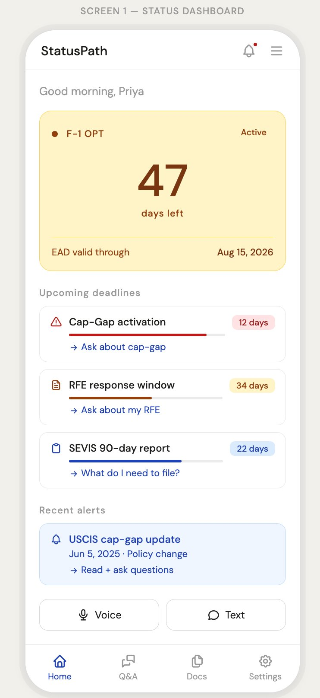
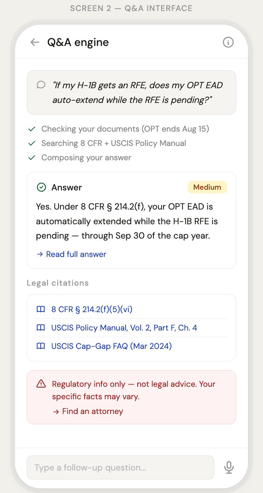
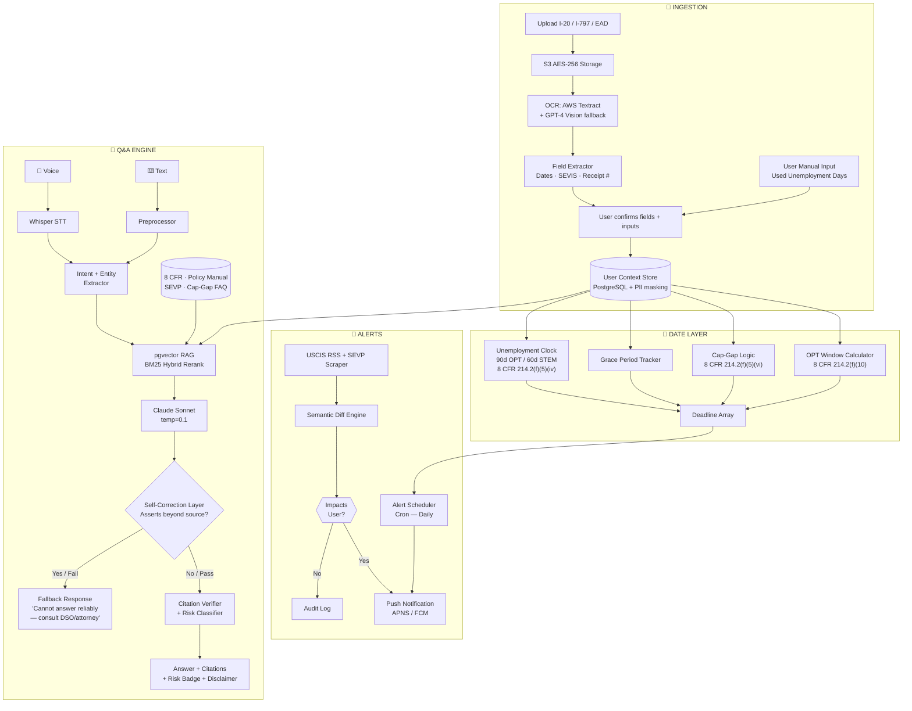
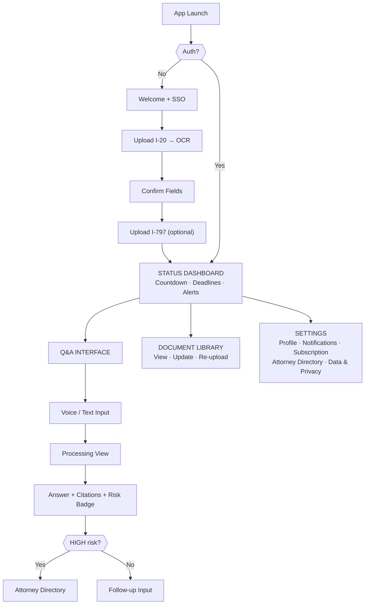

# StatusPath PRD — MVP v1.0
**F-1 OPT → H-1B Navigation Engine** | 3-Month Solo Build | Scope: F-1/STEM OPT → H-1B only

---

## 1. Executive Summary

**Problem:** 1.1M F-1 students face career-ending immigration mistakes. DSOs take 5–7 days to respond. Attorneys cost $400/hr. There is no fast, reliable, affordable option.

**Solution:** A voice/text Q&A engine grounded in 8 CFR and the USCIS Policy Manual, with OCR document parsing for personalized date-aware answers and proactive deadline alerts.

**Model:** $19/month subscription. Freemium tier (3 free queries/month) as growth lever.

| Metric | Target | How Measured |
|--------|--------|--------------|
| RAG Answer Accuracy | ≥ 92% | Monthly paralegal red-team eval |
| OCR Field Precision | ≥ 95% (PDF) / 88% (photo) | Automated test suite, 200-doc labeled set |
| Time-to-First-Value | ≤ 4 min (app open → first alert) | Analytics: `onboarding_start` → `first_alert_delivered` |
| Day-30 Retention | ≥ 35% | Subscription churn tracking — revised down from 55%; immigration is cyclical and users won't open daily after key milestones |
| Feature Engagement Rate | ≥ 60% (push notification → app open within 24h) | Push analytics — North Star metric; more meaningful than raw retention for a deadline-driven utility |

---

## 2. User Personas

**Persona A — "The OPT Sprinter"**
Priya, 24, MS CS @ Georgia Tech. OPT EAD expires in 47 days. H-1B RFE pending. Needs to know *right now* if cap-gap protects her — not in 5 business days. Too broke for an attorney consult on a factual question.

**Persona B — "The Lottery Winner in Limbo"**
Marcus, 27, MBA → consulting. H-1B selected, I-797 in hand. His employer's attorney handles the petition but won't advise on his personal STEM OPT reporting obligations. Needs a personal timeline from STEM end → cap-gap → H-1B activation.

---

## 3. MVP Feature Scope

### Must Have vs. Out of Scope

| Feature | Status | Notes |
|---------|--------|-------|
| F-1 OPT/STEM OPT → H-1B Q&A engine | ✅ Must Have | Core product |
| I-20 / I-797 / EAD OCR parsing | ✅ Must Have | Required for personalization |
| Voice query input (English) | ✅ Must Have | Key differentiator |
| Deadline countdown + push alerts | ✅ Must Have | Core retention driver |
| USCIS policy feed monitoring | ✅ Must Have | Proactive alert engine |
| Risk level classification (LOW→ESCALATE) | ✅ Must Have | Legal liability control |
| Static attorney directory | ✅ Must Have | Required safety valve |
| Freemium (3 queries/month) | ✅ Must Have | Acquisition lever |
| Green card / priority date tracking | ❌ Out of Scope | Phase 2 |
| Multi-language (Hindi, Mandarin) | ❌ Out of Scope | Phase 2 |
| TN / O-1 / J-1 visa types | ❌ Out of Scope | Phase 2 |
| Attorney booking integration | ❌ Out of Scope | Phase 2 |
| Android app | ❌ Out of Scope | iOS-first; Android in Month 4 |

### Epic Requirements (Critical Items Only)

**Epic 1 — Document Ingestion**
- Support PDF + JPEG/PNG, max 10MB
- AWS Textract (primary) + GPT-4 Vision (fallback for low-quality images)
- Extract: Program End Date, OPT/STEM dates, EAD validity, SEVIS ID, Receipt Number
- **I-20 version check required:** F-1 students accumulate 3–7 I-20s over their stay. System must compare SEVIS issuance date against any previously stored I-20 and prompt: *"Is this your most recently issued I-20?"* — onboarding cannot complete without explicit user confirmation. Uploading a superseded I-20 silently corrupts all downstream date calculations.
- **RFE notice extraction:** When an I-797 RFE is uploaded, OCR must extract the **Response Due Date printed on the notice** directly — do not calculate it programmatically. The deadline varies by RFE type and is authoritative on the document itself.
- **User must confirm extracted fields before onboarding completes** — a misread date corrupts all downstream calculations

**Epic 2 — Q&A Engine (RAG Pipeline)**

```
Voice/Text Input
  → Whisper STT (voice) / text preprocessor
  → Intent classifier + entity extractor
  → pgvector similarity search against:
       8 CFR § 214.2(f) | USCIS Policy Manual Vol.2 Part F | SEVP Guidance | Cap-Gap FAQ
  → User context injected (parsed doc fields + computed dates)
  → Claude Sonnet @ temp=0.1
  → Self-Correction Layer: Claude evaluates its own draft against retrieved chunks —
       "Does this answer assert anything not explicitly present in the source text? (Yes/No)"
       If Yes → response is suppressed; fallback = "Cannot answer reliably — consult DSO/attorney"
  → Citation verifier → Risk classifier
  → Response: Answer + inline citations + risk badge + disclaimer
```

**Epic 3 — Deadline Tracking & Alerts**

| Deadline | Logic | Alert At |
|----------|-------|----------|
| OPT EAD Expiry | `status.opt_end_date` | 90/60/30/14/7 days |
| STEM OPT Expiry | `status.stem_end_date` | 90/60/30/14/7 days |
| STEM OPT 6-Month Validation | `stem_opt_ead.start_date + 180/360/540/720 days` — per 8 CFR § 214.2(f)(12)(i); NOT calculated from employment start date | 14/7 days before each milestone |
| Cap-Gap Coverage | Cap-gap work authorization bridges `opt_end_date → Sep 30` if timely H-1B petition was filed + selected. **Two Oct 1 outcomes:** (1) H-1B approved → status activates Oct 1, work resumes normally; (2) H-1B still pending on Oct 1 → work authorization halts Sep 30 but lawful cap-gap *stay* continues until adjudication. System must surface this distinction clearly — user cannot work but is not out of status. | On OPT expiry + 30 days before Sep 30 + **Sep 16 proactive check (see note below)** |

> **Cap-Gap Sep 16 Proactive Check (churn mitigation):** 14 days before Sep 30, the app must trigger an in-app prompt: *"Has your employer received an H-1B approval notice yet?"*
> - **If Yes →** Prompt I-797 approval notice upload; transition dashboard to H-1B Active on confirmation. Celebrate the milestone — this is a high-emotion positive moment.
> - **If No / Still Pending →** Deliver a dedicated resource guide: what the Oct 1 cap-gap freeze means in plain language, a script for talking to HR about the work authorization pause, and a reminder that lawful stay continues. Position the app as a strategic guide, not a doomsday clock. Do **not** send a bare "Your work authorization has ended" push notification on Oct 1 without this context already set.
| H-1B RFE Response | **Response Due Date extracted from I-797 RFE notice via OCR** — not calculated; deadline is authoritative on the document | 30/14/7/2 days |
| 60-Day Grace Period Start | `opt_end_date` (if no cap-gap) | On OPT expiry |
| Unemployment Days Remaining | `90 days − accumulated_unemployment` (initial OPT); `60 days − accumulated_unemployment` (STEM OPT). Requires onboarding input: "How many unemployment days did you use in initial OPT?" Dashboard shows live counter. | At 30/14/7 days remaining |

USCIS feed monitor runs daily; targeted alerts delivered within 4 hours of policy change detection.

**Epic 4 — Guardrails**

| Risk Level | Trigger | Response Behavior |
|------------|---------|-------------------|
| LOW | Factual regulatory lookup | Full answer + standard disclaimer |
| MEDIUM | Scenario-based with user variables | Full answer + "verify with DSO" CTA |
| HIGH | Complex; individual facts material | Partial answer + attorney CTA |
| ESCALATE | Potential past violation OR out of scope | No substantive answer; attorney directory only |

---

## 4. User Journey

```
1. DOWNLOAD  →  LinkedIn referral → App Store → Google SSO (< 2 min)

2. ONBOARD   →  Upload I-20 → OCR extracts fields → SEVIS issuance date check confirms most recent I-20
                → User inputs accumulated unemployment days used during initial OPT
                → User confirms all extracted fields → Upload I-797 (optional)
                → Status Dashboard unlocks → First deadline alert delivered
                TARGET: T2FV ≤ 4 minutes ✓

3. QUERY     →  Taps "Ask" → Voice: "Does cap-gap cover me during my RFE?"
                → Processing: transcribe → retrieve 8 CFR → inject user context → generate
                → Response in ~6s: Answer + 3 citations + MEDIUM badge + disclaimer

4. ALERT     →  Day 3: Push notification "USCIS updated cap-gap guidance — affects your status"
                → Deep-links to Q&A with pre-loaded context about the change

5. CONVERT   →  Day 4: 3rd free query hits paywall → subscribes via Apple Pay ($19/month)
                → RFE deadline (34 days out) ensures return visit within 7 days
```

---

## 5. Wireframes

### Screen 1: Status Dashboard



Status card color: Amber (OPT active) → Red (<14 days) → Green (H-1B active). Deadline bars turn red ≤7 days.

---

### Screen 2: Q&A Interface



Risk badge colors: LOW = green | MEDIUM = amber | HIGH = orange | ESCALATE = red. Citations are tappable → uscis.gov source URLs.

---

### System Architecture


---

### App Navigation Map


---

## 6. Legal, Security & Trust

### Legal Guardrails

| Requirement | Implementation |
|-------------|---------------|
| "Not Legal Advice" disclaimer | On every Q&A response — non-dismissible |
| Onboarding consent | Explicit [I Understand] tap required before first query |
| Hallucination prevention | Citation verifier blocks responses citing non-existent regulations; retrieval-bounded only |
| Confidence floor | Cosine similarity < 0.75 triggers fallback, but vector distance alone is insufficient — a score of 0.76 can still produce wrong answers. Primary guard is the Self-Correction Layer in Epic 2; cosine threshold is a secondary signal only |
| Human review loop | 5% random query sample reviewed weekly by contracted immigration paralegal |
| Attorney directory disclosure | "No referral fees received" stated explicitly in directory UI |
| Clipboard disclaimer | When user copies any answer text, append to clipboard: *[Generated via StatusPath AI. Not legal advice. Verify with a DSO or attorney.]* — protects platform if answer is forwarded to HR or employer |

### Data Security

| Layer | Requirement |
|-------|-------------|
| Encryption at rest | AES-256 + SSE-KMS; separate KMS key per user |
| Encryption in transit | TLS 1.3 minimum; HSTS enforced |
| Document access | Signed S3 URLs, 15-min expiry; no public bucket access |
| PII in DB | SEVIS ID, EAD #, receipt numbers Fernet-encrypted before write |
| OCR raw output | Deleted from memory immediately after field extraction — not persisted |
| Log sanitization | PII scrubbed at the server edge **before logs leave the application layer** — not at CloudWatch ingestion. Sanitizing late means a pipeline crash could still route raw PII to Sentry or other crash reporters |

### Data Retention

| Data Type | Retention | Deletion |
|-----------|-----------|---------|
| Uploaded documents | Active subscription + 30 days post-cancel | Automated S3 lifecycle rule |
| Extracted fields | Active subscription + 90 days post-cancel | Automated DB job |
| Q&A logs (anonymized) | 12 months | Opt-out in Settings → Privacy |
| Billing data | 7 years (Stripe PCI-DSS) | Managed by Stripe |

**Compliance targets:** CCPA (launch) → SOC 2 Type I (Month 6) → SOC 2 Type II (Month 12)

---

## Appendix: Stack + Sprint Plan

**Tech Stack (Solo Developer):** SwiftUI (iOS) · FastAPI · Supabase (PostgreSQL + pgvector + Auth) · AWS Textract + S3 + KMS · Claude Sonnet · Whisper API · AWS SNS → APNS

> **Platform decision:** Committing to SwiftUI for solo-dev velocity. Android deferred to Month 4. Known risk: MS CS international student demographic skews heavily Android (South Asia), which may throttle early freemium acquisition. **Pivot trigger:** if landing page analytics show >50% of traffic arriving from Android mobile browsers before Sprint 4 ends, switch frontend stack to Flutter + Firebase Cloud Messaging (FCM) immediately — before any RAG interface code is written in Sprints 5–6. Pivoting after Sprint 6 is too costly to undo.

| Sprints | Deliverable |
|---------|-------------|
| 1–2 | OCR pipeline + I-20/I-797 parsing + field confirmation UI |
| 3–4 | Date calculation engine + Status Dashboard |
| 5–6 | RAG corpus ingestion + Q&A engine (text) |
| 7–8 | Voice input + alert scheduler + USCIS feed monitor |
| 9–10 | Guardrails + attorney directory + disclaimer system |
| 11–12 | Security audit + polish + TestFlight beta |
